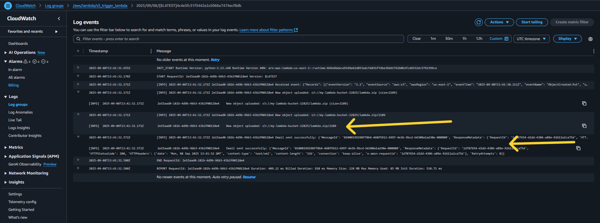

## Task
Create an s3 bucket that will automatically trigger a lambda function whenever a new file is uploaded to the bucket. Tha lambda function should respond to the event by doing something simple. For example, it can print the name of the uploaded file, write a message to cloudwatch logs, or send an email using Amazon SES to confirm the upload.

## Deliverable
Provide screenshots of S3 bucket showing event trigger connected to your lambda function. Also include a screenshot of your lambda function code or settings. Finally, show proof that the function worked, like a log in cloudwatch or the email received in SES.

**For this project, I will provision the infrastructure with Terraform instead of using the AWS management console to improve my terraform skills, I will be needing an AWS account with programmatic access, an IAM user AWS CLI and Terraform**.

## Setup
The terraform resources for this project includes an s3 bucket with blocked public access with an uploaded zipped lambda code file which fires a lambda event, With the appropriate IAM role, the lambda has permission to trigger an event when a new object is uploaded to the bucket and writes logs to cloudwatch (it shows the name of the image uploaded with a timestamp).

## Workflow
I upload a file to my s3 bucket, it fires an event. S3 checks bucket_notification and calls the Lambda, S3 is allowed to invoke Lambda because of aws_lambda_permission. Then, Lambda runs with permissions from its IAM role and writes logs to CloudWatch. In CloudWatch, the file name printed among other information (from the Lambda code) is visible.

## Steps
- Create the config file with terraform, these files include:
- `provider.tf` - holds the provider and its configurations.
- `variables.tf` - declare input variables that act as placeholders for values that can be customized in infrastructure code.
- `main.tf` - holds the resources to create: a bucket (with an attribute to automatically delete all objects when destroying the bucket), to automate file upload to S3 bucket, using the aws_s3_object resource, to block public access to the S3 bucket, to auto-zip my Lambda code so Terraform can package and deploy it, an iam role the Lambda function will assume when it is executed with a policy attachment, a lambda function, permission to allows s3 invoke lambda, link bucket to lambda and a log retention period for the Lambda's log group.

- Configure the CLI with `aws configure`.


- Run a `terraform init` to initialize the working directory containing my configuration files to download all the necessary provider plugins.


- Run a `terraform plan` to create an execution plan used to preview the changes that Terraform plans to make to my infrastructure. My config is using a datasource (an external resource not created or managed by my terraform config) so it will have to read the datasource instead of fetching the resource


- Run a `terrform apply` to execute the actions proposed in the plan, the `--auto-approve` flag skips the interactive approval prompt.


- The images below show the deliverables required from this task which includes:

- S3 bucket showing event trigger connected to your lambda function.


- Lambda function code or settings.


- Proof that the function worked: I sent my logs to cloudwatch and it included the name of the new file I uploaded. This can be viewed from the cloudwatch logs dashboard (I navigated to the the latest log of my log group)




- To avoid incurring costs, I used the `terraform destroy` command to teardown my resources.


## An error I encountered
- Error 1: This error occurred as a result of permission issues around my bucket.


My terraform user (the user running the `terraform apply` command) didn't have the appropriate S3 permissions, I upgraded the user by adding the following actions:
``` 
 "s3:GetBucketNotification",
  "s3:PutBucketNotification",
  "s3:GetBucketPublicAccessBlock",
  "s3:PutBucketPublicAccessBlock"     
```


