# Task: Configure AWS Identity Center in your account. Create a new user and assign them a permission set using the predefined SecurityAudit job function policy

AWS IAM Identity Centre (formerly AWS SSO) is a service that provides a central place to manage workforce identities and their access to multiple AWS accounts and applications.

## Steps
- Navigate to IAM Identity Center from IAM dashboard or search for via the search bar. An instance of this service has to be enabled with organisations.

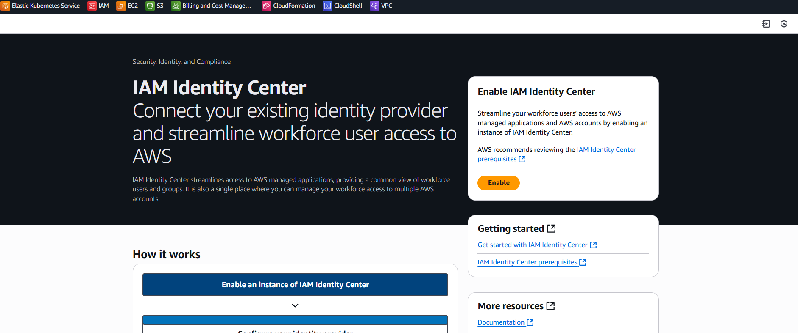

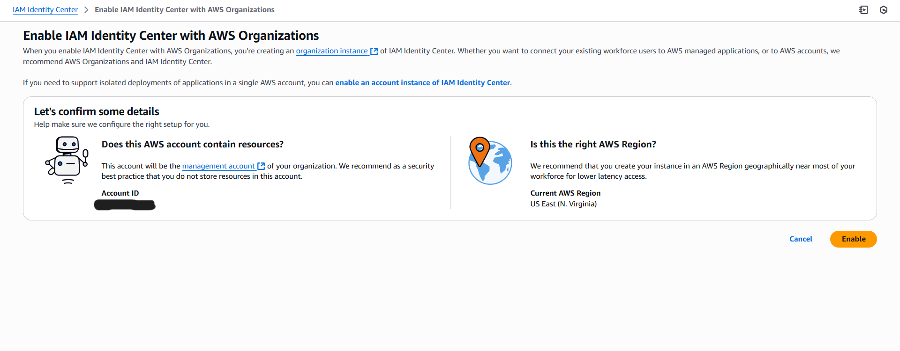

- After enabling the IAM Identity Center, navigate to the dashboard and from the dashboard, navigate to AWS organisations to view the added account in the organisation.

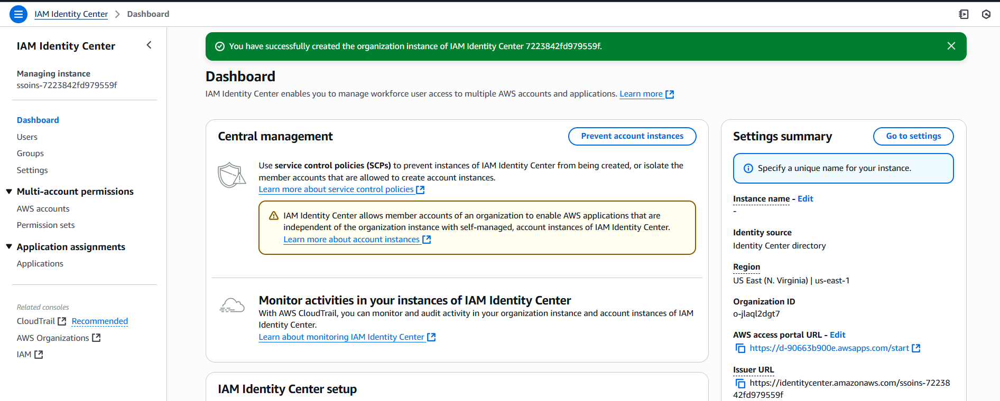

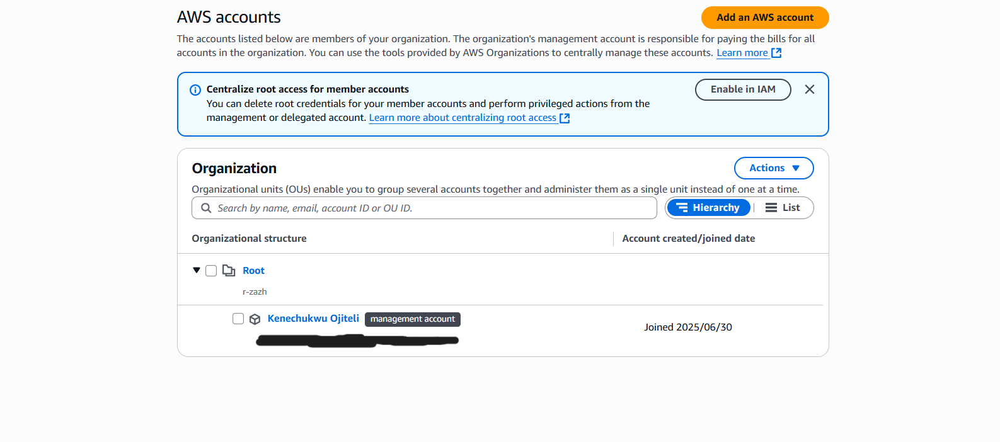

- Edit the settings by specifying an instance name and the access portal URL (to something mor human-friendly).

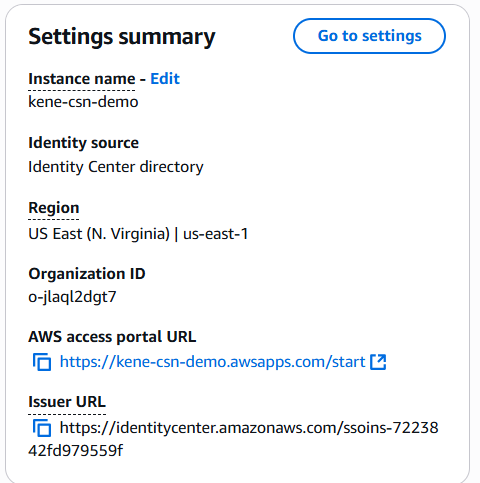

- Create a user and save the user's password details to be used in a later step (note that this can be viewed just once).

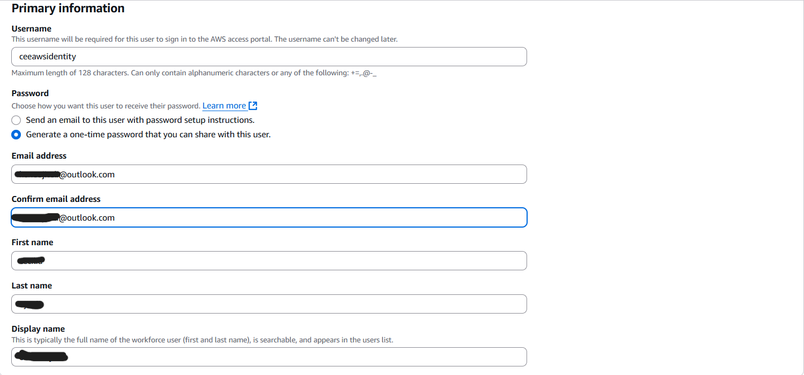

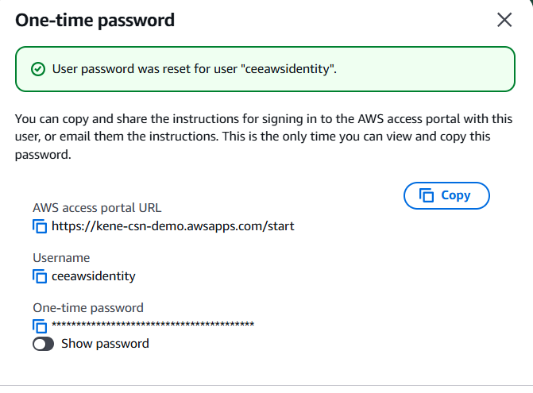

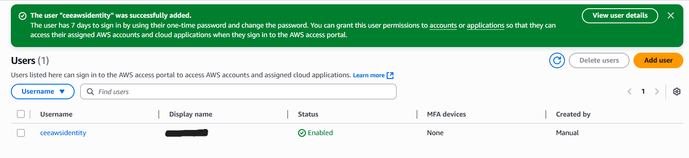

- Next, create a permission set (permission set defines the level of access users in the IAM identity center have to their assigned AWS accounts), this can be found on the LHS of the IAM identity center.

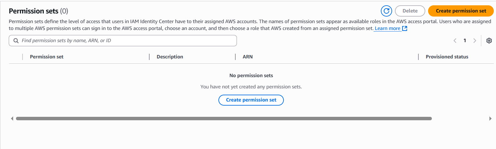

- I'll be using a **predefined permission set**, the SecurityAudit AWS managed policy.

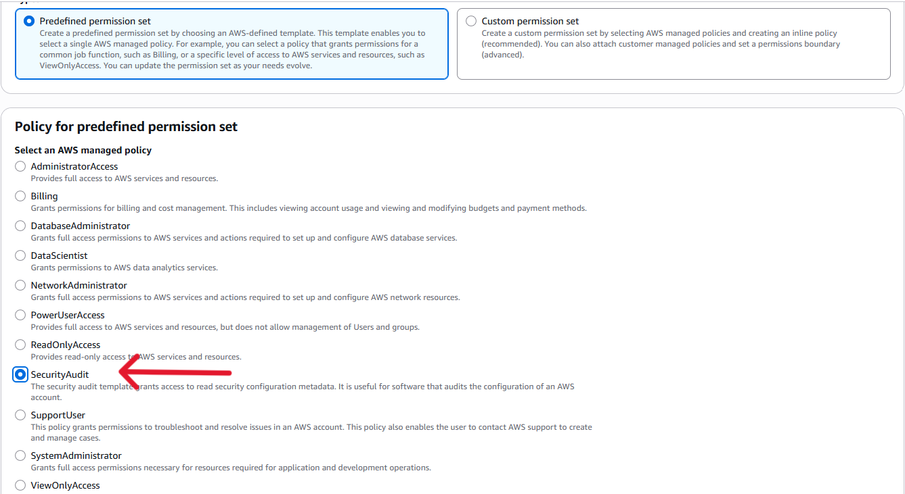

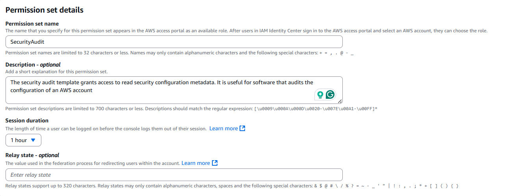

- Navigate to AWS account to bind the permission set to the created user. Click on the **Assign users or groups** button.

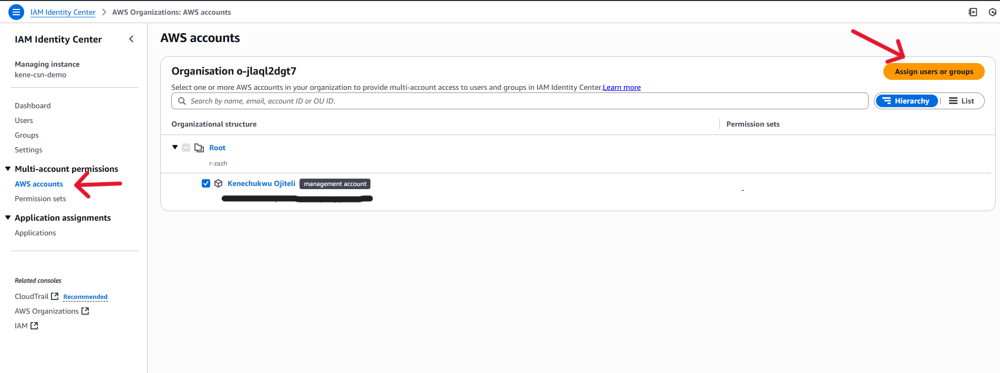

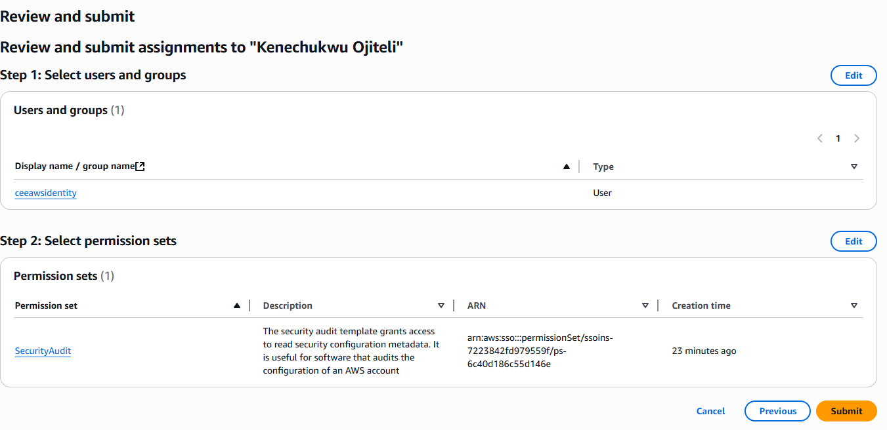

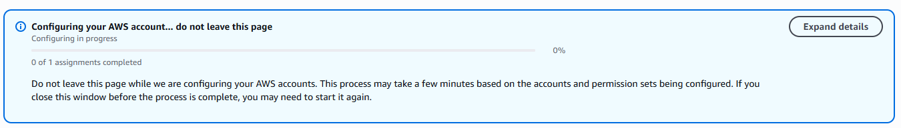

- After attaching the permission set to the user, I will login with the user (preferably on another browser to create a new session) using the access portal URL, to test the policy.

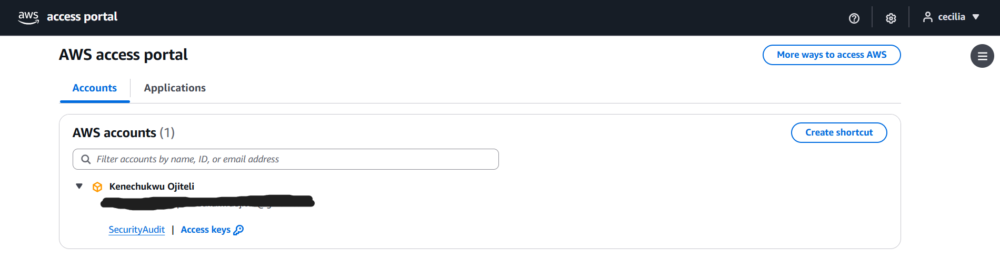

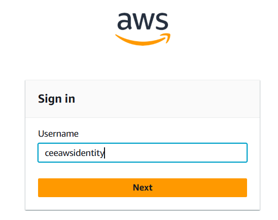

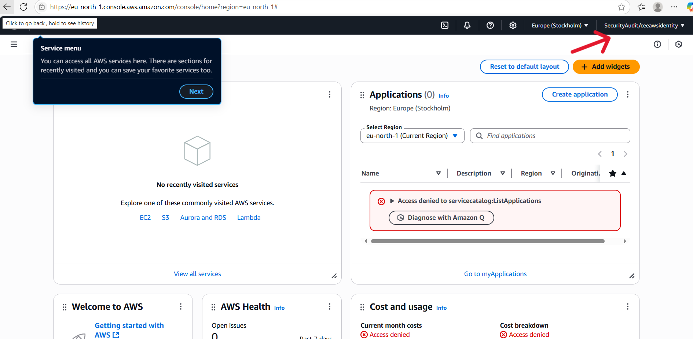

- I tried to test by creating an IAM user and got the error below. This means that the  SecurityAudit permission set grants access to read security configurations metadata only and creating an IAM user does not fall under that.

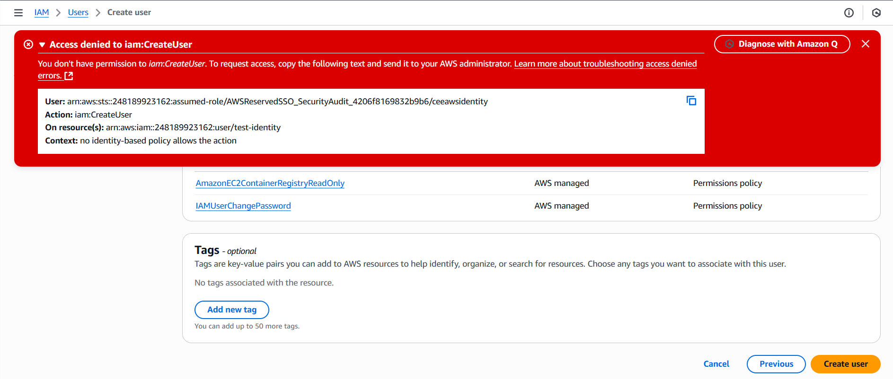
