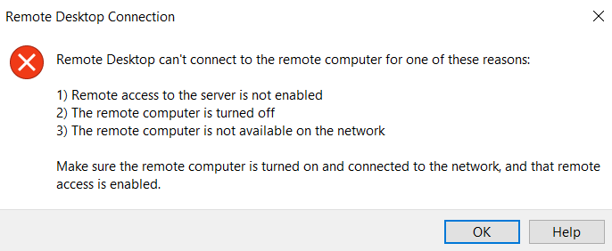

## Task
Launch a new Windows Server EC2 instance using the Amazon Windows Server 2019 Base AMI or a later version. Ensure the instance is deployed on a public subnet and secured with a security group that permits RDP access (port 3389) only from your public IP address. Assign the instance a Name tag with the value **CSN-Bootcamp-Week3**.

## Deliverable
 Provide screenshot of your running windowsEC2 instance in the AWS management console. The screenshots should clearly show the instance's name CSN-Bootcamp-Week3, the security group inbound rules allowing RDP (port 3389) only from your public IP address, and a successful RDP connection to the instance.

**For this project, I will provision the infrastructure with Terraform instead of using the AWS management console, I will be needing an AWS account with programmatic access, AWS CLI and Terraform**.

## Steps
- Create the config file with terraform, these files include: main.tf (holds the resources to be provisioned on AWS), provider.tf (holds the provider and its configurations), which can be found in the repo.
- Configure the CLI with `aws configure`.

    

- Run a `terraform init` to initialize the working directory containing my configuration files to download all the necessary provider plugins.

    

- Run a `terraform plan` to create an execution plan used to preview the changes that Terraform plans to make to my infrastructure.

    
    
    
    

- Run a `terrform apply` to execute the actions proposed in the plan.
    
    

- After creating the resources with terraform, I went ahead to check the resources on AWS management console, starting with the VPC, the resource map shows a visual representation of the VPC's architecture and resource relationships.
    

- The resource block below shows my security group inbound rules allowing RDP (port 3389) only from my public IP address.

    

- The the EC2 instance named **csn-bootcamp-week3**.
    

- Next up is to connect to the instance using the connect button.
    

- I will connect to the instance using the `RDP client` option, meaning I have to download and save the RDP client on my local machine.
    
    

- After saving the RDP client locally, I will need to connect and initiate a remote connection.
    
    

- After initiating a connection, I need to enter my credentials to connect to the instance.

    

- I created a keypair on AWS, downloaded the private key to my local machine and I referenced the keypair in my terraform config file, to connect to the instance, I have to upload the private key, decrypt the key and get a password to connect to the instance.

    
    
    
    

- After decrypting the password, I connected to the windows instance.

    
    
    

- To avoid incurring costs, I used the `terraform destroy` command to teardown my resources.

    
    
    

## Some errors I encountered
- Error 1: this error was caused because the machine type was not compatible with the AMI I choose; I tested with a couple of AMIs before settling for a base AMI (windows server 2019 base).

    

- Error 2: Even though I allowed an inbound rule on port 3389 to only my IP address this error occured because AWS uses a different IP detection method (uses live browser IP detection) `api.ipify.org` and not `ifconfig.me` (used by terraform) to get public IP.

    

