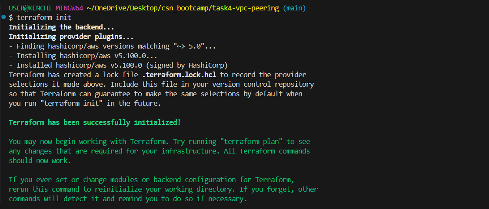

## Task
Create 2 VPCs to simulate a multi-VPC architecture; Configure VPC-A with cidr block - 10.10.0.0/16, and VPC-B with cidr block - 10.20.0.0/16. In each VPC, attach a public and private subnet (no need for internet and NAT gateways). Establish a VPC peering connection between the 2 VPCs and update the route tables in each VPC to allow traffic to flow between them via the peering connection.

## Deliverable
Provide clear screenshots showing the 2 VPCs and their CIDR blocks, the subnets in each VPC, the VPC peering connection in active status and the route tables with routes pointing to the other VPCs cidr block through the peering connection.

**For this project, I will provision the infrastructure with Terraform instead of using the AWS management console to improve my terraform skills, I will be needing an AWS account with programmatic access, AWS CLI and Terraform**.

## Architecture Diagram

   

## Setup
The terraform resources for this project includes 2 VPCs each having a private and public subnet, a route table holding a list of rules (routes) for where to send network traffic for each VPC, a route table association linking the subnets in each VPC to a route table, a VPC peering connection to establish a connection between VPC A & B, and a route for peering traffic after peering is established (each VPC must route traffic to the other VPCs CIDR block through the peering connection).

## Steps
- Create the config file with terraform, these files include: `main.tf` (holds the resources to be provisioned on AWS), `provider.tf` (holds the provider and its configurations), and `variables.tf` (declare input variables that act as placeholders for values that can be customized in infrastructure code) which can be found in the repo.
- Configure the CLI with `aws configure`.

    

- Run a `terraform init` to initialize the working directory containing my configuration files to download all the necessary provider plugins.

    

- Run a `terraform plan` to create an execution plan used to preview the changes that Terraform plans to make to my infrastructure.

    
    

- Run a `terrform apply` to execute the actions proposed in the plan.

    
    
    

- The images below show the deliverables required from this task which includes:
- 2 VPCs and their CIDR blocks + The subnets in each VPC.

    
    
    

- The VPC peering connection in active status (because I used Terraform, the connection was automatically accepted).

    
    

- The route tables with routes pointing to the other VPCs cidr block through the peering connection (I had already specified the routes to point to each VPCs cidr block, so there was no need to update the routes).
    
    

- To avoid incurring costs, I used the `terraform destroy` command to teardown my resources.
   
   

- To test the peering connection, an EC2 instance can be cretaed in each VPC and connect to each other via SSH on port 22, but there has to be an internet gateway (if the instance will be on a public subnet) or a NAT gateway (if the instance will be on a private subnet). I tested without an internet gateway and the SSH connection timed out.

## Some errors I encountered
- Error 1: this error was caused because I was using a meta-data argument for numbers to reference a list of string.

   

- Error 2: this error was caused because I called a variable with list of string type as just a string.
   