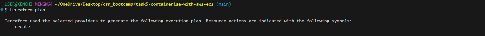
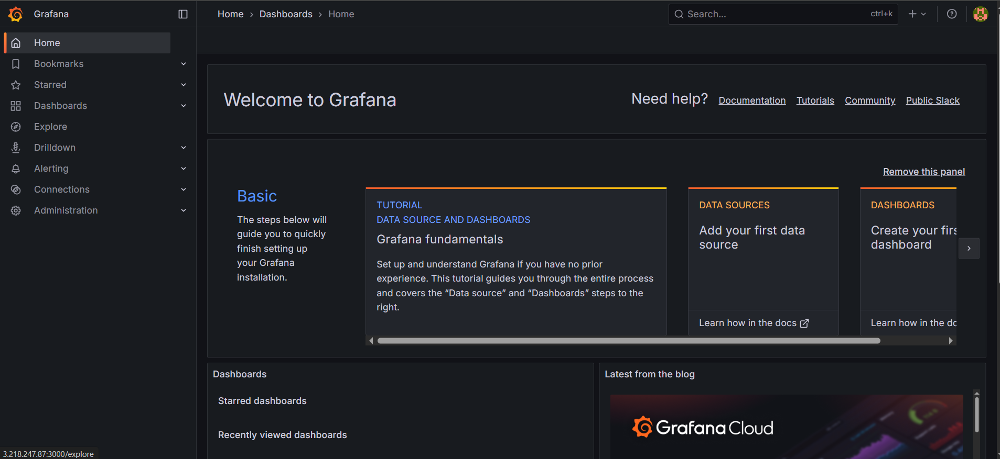

## Task
Deploy Grafana (running on port 3000) using AWS ECS with fargate, use the official docker image grafana/grafana, create a task definition that exposes port 3000 and run it in a public subnet. Ensure security group allows inbound traffic for port 3000. Once the service/task is running, access it via `http://<public-ip>:3000` on your browser.

## Deliverable
Show screenshots showing ECS cluster and running service, the task definition with the grafana/grafana image, and the security group rule allowing port 3000 access. Include a screenshot showing login to grafana using the credentials: `username=password=admin`.

**For this project, I will provision the infrastructure with Terraform instead of using the AWS management console to improve my terraform skills, I will be needing an AWS account with programmatic access, AWS CLI and Terraform**.

## Setup
The terraform resources for this project includes an ECS cluster with fargate launch type, that has a task definition and a service, a VPC with a public subnet where the task definition will be deployed using grafana's official image, a route table holding a list of rules (routes) for where to send network traffic for each VPC, a route table association linking the public subnet in the VPC to a route table.

## Steps
- Create the config file with terraform, these files include: `ecs.tf` (holds the ECS resources to be provisioned on AWS including an ECS cluster, a task definition and a service), `vpc.tf` (holds the network infrastructure including a VPC, subnet, internet gateway, a route table and its association with a security group), `iam-role.tf` (allows ECS tasks to assume a role and a policy attachment that attaches a predefined AWS-managed policy), `provider.tf` (holds the provider and its configurations), and `variables.tf` (declare input variables that act as placeholders for values that can be customized in infrastructure code) which can be found in the repo.
- Configure the CLI with `aws configure`.

- Run a `terraform init` to initialize the working directory containing my configuration files to download all the necessary provider plugins.

- Run a `terraform plan` to create an execution plan used to preview the changes that Terraform plans to make to my infrastructure.

- Run a `terrform apply` to execute the actions proposed in the plan.

- The images below show the deliverables required from this task which includes:
- ECS cluster and running service.

- The task definition with the grafana/grafana image.

- The security group rule allowing port 3000 access.

- Successful login to grafana using the credentials: username=password=admin

- To avoid incurring costs, I used the `terraform destroy` command to teardown my resources.

## An error I encountered
- Error 1: this error was caused because my subnet with the task definition did not have internet access to pull the grafana image from docker.

- I resolved it by assigning a `assign_public_ip = true` property in my ECS service network configuration, ensured my public subnet has route to `0.0.0.0/0` via an internet gateway and allowed inbound access to port 80 (HTTP) as shown in the image below and in the terraform config file.

    

