## Task
Deploy Metabase on Amazon ECS using fargate launch type and connect it to a Postgre sql database hosted on Amazon RDS. Use the official metabase docker image from dockerhub and configure the environment variables needed for database connectivity. Ensure both ECS and RDS are in the same VPC to allow communication. The RDS security group should allow inbound traffic on port 5432 from the ECS task.

## Deliverable
Show screenshots showing the RDS Postgres instance details, the ECS task definition and running service, the security group rules allowing traffic from ECS to RDS on port 5432, and the metabase setup screen confirming a successful connection to the database.

**For this project, I will provision the infrastructure with Terraform instead of using the AWS management console to improve my terraform skills, I will be needing an AWS account with programmatic access, AWS CLI and Terraform**.

## Setup
The terraform resources for this project includes a postgres sql database hosted on Amazon RDS in a private subnet with an ECS cluster with fargate launch type, that has a task definition and a service where metabase will be deployed on, a load balancer with its listener (listening on port 80) and target group (that routes traffic from the ALB listener to the ECS container).

## Workflow: 
In the security group, the Application Load Balancer accepts HTTP traffic as it is internet facing; the ECS tasks accept traffic from the Application Load Balancer; RDS accepts traffic only from ECS tasks. The postgres sql db hosted with rds is deployed in a private subnet (which is a best practice), the ECS is deployed in a public subnet to easily pull the metabase image (although it can be deployed in a private subnet with NAT gateway to access the internet), all in the same VPC for easy communication.

## Steps
- Create the config file with terraform, these files include: 
- `provider.tf` - holds the provider and its configurations.
- `variables.tf` - declare input variables that act as placeholders for values that can be customized in infrastructure code.
- `outputs.tf` - prints out the URLs after deployment for easy access to avoid digging around the AWS Console.
- `db.tf` - holds the resources to create an RDS database instance and a subnet group (that holds a lists of subnets)
-  `lb.tf` - holds the resources that creates an application load balancer, its listener and target group.
- `ecs.tf` - holds the ECS resources to be provisioned on AWS including an ECS cluster, a task definition and a service, and a cloudwatch resource to implement logging. 
- `vpc.tf` - holds the network infrastructure including a VPC, subnets, internet gateway, a route table and its association. 
- `iam-role.tf` - allows ECS tasks to assume a role and a policy attachment that attaches a predefined AWS-managed policy.
- `sg-tf` - holds rules to ensure proper connection between the application load balancer, the ecs task and the rds instance.

- Configure the CLI with `aws configure`.
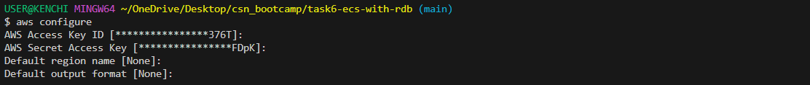

- Run a `terraform init` to initialize the working directory containing my configuration files to download all the necessary provider plugins.
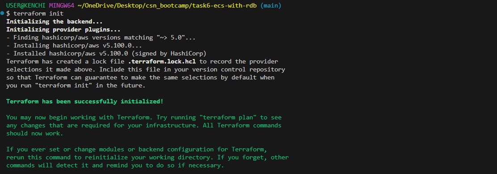

- Run a `terraform plan` to create an execution plan used to preview the changes that Terraform plans to make to my infrastructure.
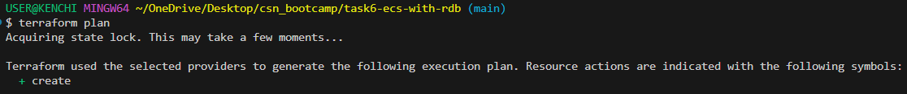
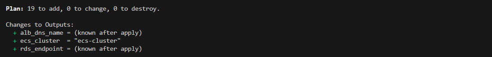

- Run a `terrform apply` to execute the actions proposed in the plan.
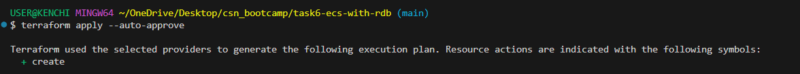
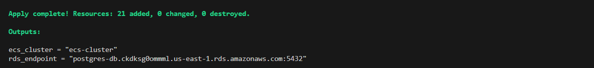

- The images below show the deliverables required from this task which includes:

- RDS Postgres instance details.
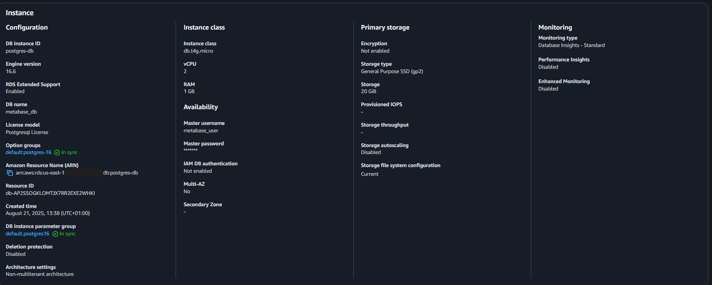
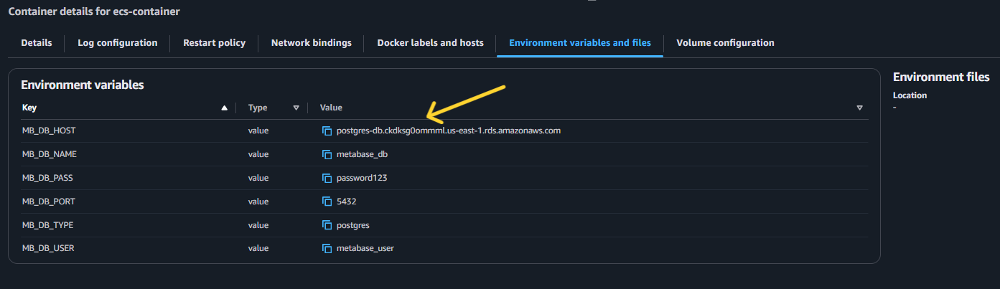

- ECS task definition and running service.
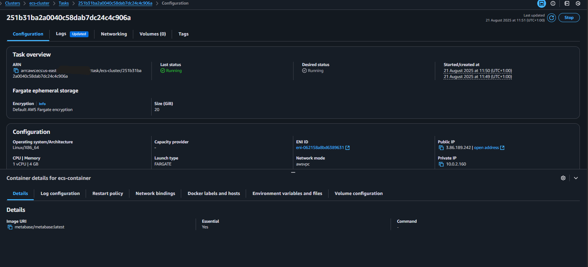
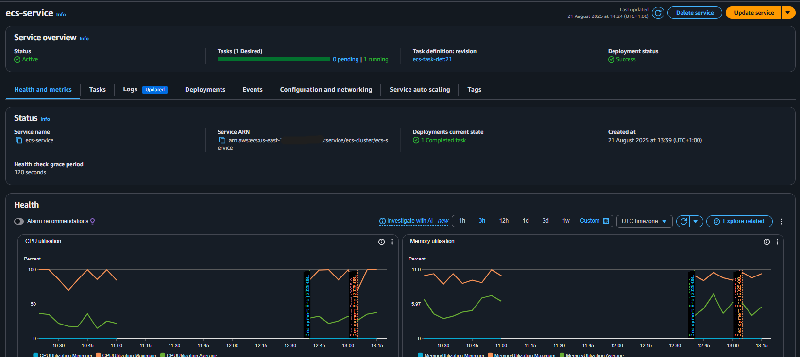

- Security group rules allowing traffic from ECS to RDS on port 5432.
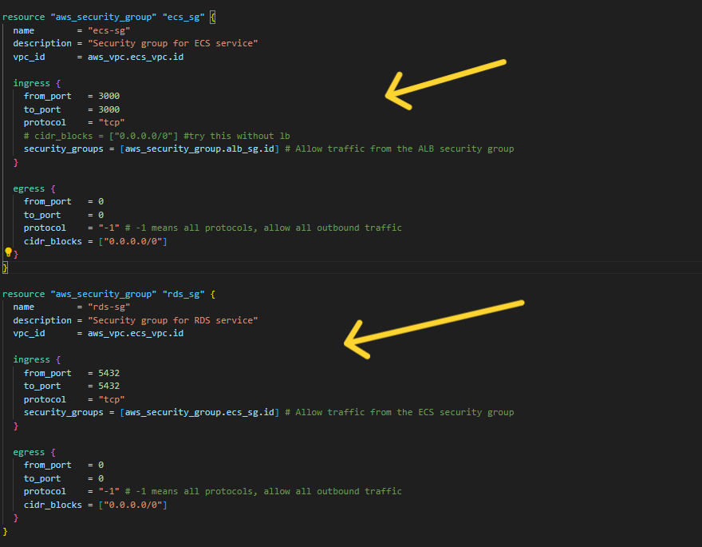

- Metabase setup screen confirming a successful connection to the database: unfortunately, I was not able to successfully access metabase because of failed health/start checks - **this is still being debugged by the way, I will update as soon as it is fixed**
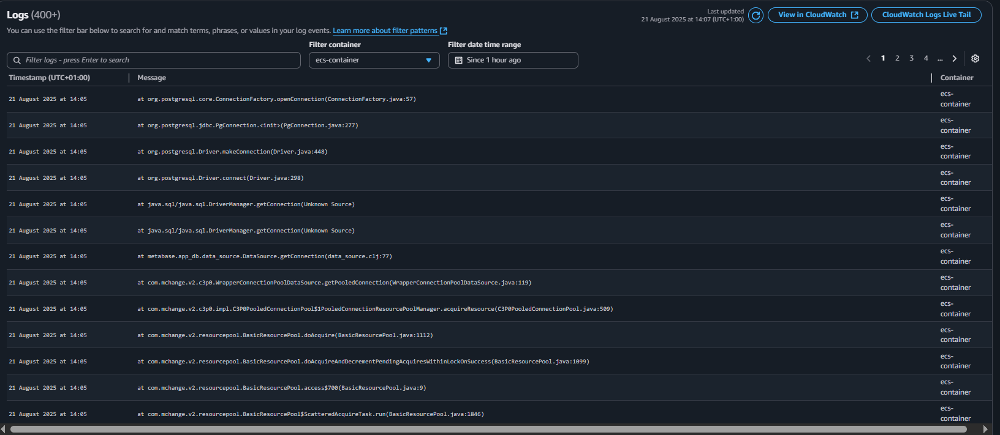

#### Proactive steps I took to debug connection between Metabase and Database
- I figured I was attaching the security group to the particular resource that owns it (eg, I attached the ecs_sg to the ecs resource, instead of attaching it to the rds resource).
- I used a wrong environment variable: `MB_DB_NAME` instead of `MB_DB_DBNAME`  
- I created a `cloudwatch` resource to check my logs to verify why my tasks were failing.
- I tweaked my `engine_version`  to use various valid versions.
- I ensured I used the correct environment variables names and values in my task definition.
- I tweaked my load balancer target group healthcheck arguments (from paths (/, /api/health, /healthy, etc) to other values).
- I ensured my security group had the right flow: ALB accepts HTTP; ECS tasks accept from ALB; RDS accepts only from ECS tasks.
- I switched my environment variable `MB_DB_HOST` value from `aws_db_instance.my_db.address` to `aws_db_instance.my_db.endpoint` to resolve DB host.
- I increased my `cpu` and `memory` capacity because metabase requires higher storage capacity.

- To avoid incurring costs, I used the `terraform destroy` command to teardown my resources.
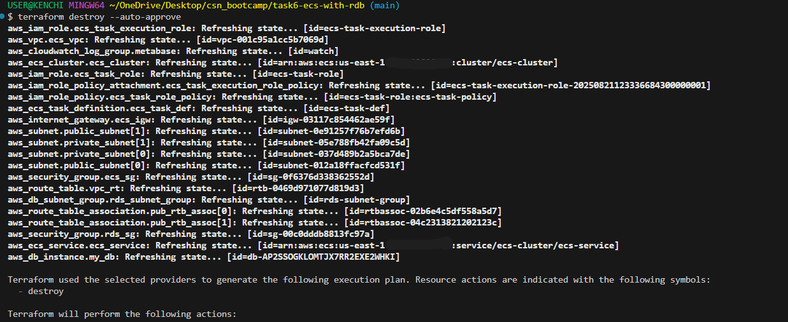
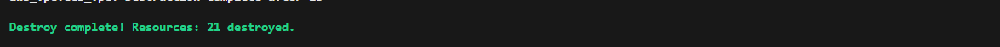

## Some errors I encountered
- Error 1: this error was caused because I used the `cidr_blocks` argument to reference a security group. I resolved it by using a `security_group` argument.
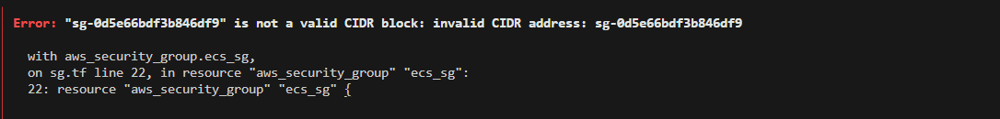

- Error 2: this error was caused by having just one availability zone in my configuration, meanwhile application load balancers require multi-AZ for redundancy. I resolved it by increasing my availability zone to 2.
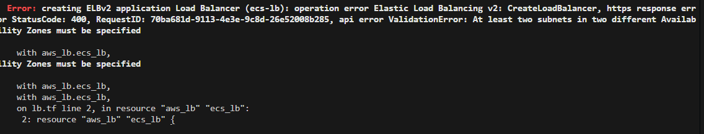

- Error 3: RDS requires at least 2 subnets in 2 different Availability Zones. Even if a single-AZ database is the goal, AWS enforces this because RDS wants the option to failover, I increased my subnet to 2 and added the subnets to `aws_db_subnet_group`.
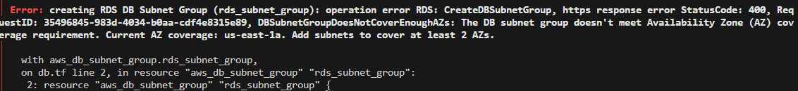

- Error 4: This were majorly syntax errors, Terraform expected a string, but I give it a list of strings, etc.
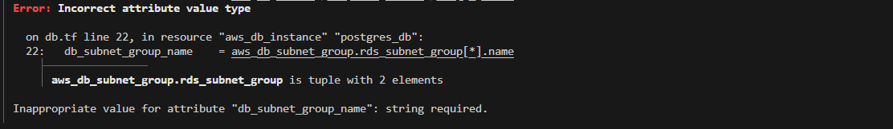

- Error 5: this error was caused because I used a reserved username (admin) for my choice of username. I resolved it by change my username to a non-reserved one.
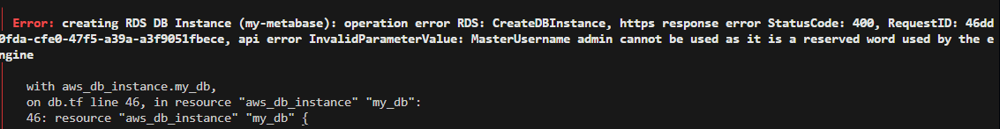

- Error 6: The erroros below were caused by issues around failing healthchecks which caused my ECS task to go from pending -> running -> deprovisioned -> stopped state; After so much research, I was unable to resolve the issue.
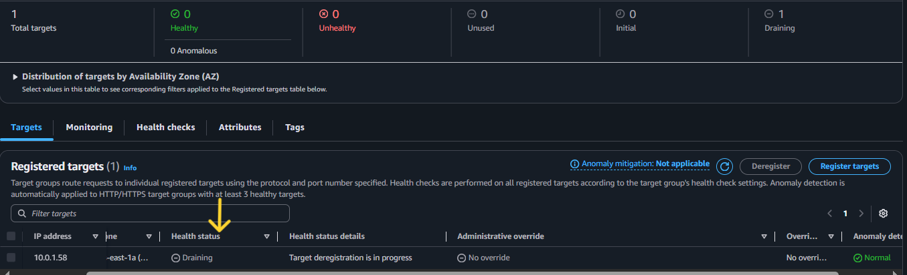
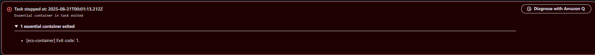

  

