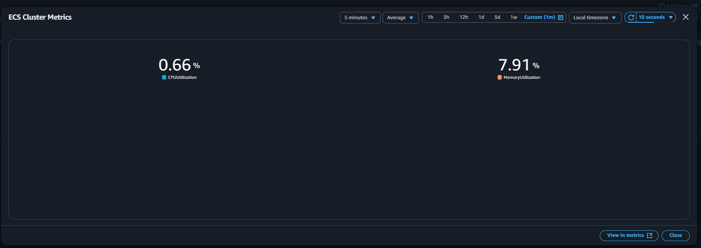
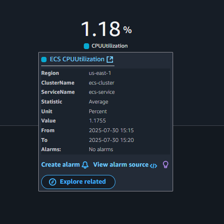

## Task
Deploy a containerised application (eg nginx or grafana) on Amazon ECS with fargate, using appropriate CPU and memory settings in a public subnet. Create a cloudwatch dashboard with widgets for CPUUtilization and MemoryUtilization to monitor the ECS task in real time. For deeper insight, simulate load by refreshing or stressloading the app and observe how the metrics changes.

## Deliverable
Show screenshots having ECS cluster and running service, the task definition with CPU and memory settings, cloudwatch dashboard with CPU and memory widgets. Optionally, include a screenshot showing changes in metrics under simulated workload. 

**For this project, I will provision the infrastructure with Terraform instead of using the AWS management console to improve my terraform skills, I will be needing an AWS account with programmatic access, an IAM user AWS CLI and Terraform**.

## Setup
The terraform resources for this project includes an ECS cluster with fargate launch type, that has a task definition and a service, a VPC with a public subnet where the task definition will be deployed using grafana's official image, a route table holding a list of rules (routes) for where to send network traffic for each VPC, a route table association linking the public subnet in the VPC to a route table and a cloudwatch dashboard with widgets to monitor the CPUUtilization and MemoryUtilization for the application.

## Steps
- Create the config file with terraform, these files include: 
- `ecs.tf` - holds the ECS resources to be provisioned on AWS including an ECS cluster, a task definition and a service. 
- `vpc.tf` - holds the network infrastructure including a VPC, subnet, internet gateway, a route table and its association with a security group.
- `iam-role.tf` - allows ECS tasks to assume a role and a policy attachment that attaches a predefined AWS-managed policy. ECS uses this role to pull container images, write logs to CloudWatch, among other roles.
- `dashboard.tf` - holds the resources to create a dashboard, to visualize metrics from ECS service/task.
- `provider.tf` - holds the provider and its configurations.
- `variables.tf` - declare input variables that act as placeholders for values that can be customized in infrastructure code,  these files can be found in the repo.

- Configure the CLI with `aws configure`.

- Run a `terraform init` to initialize the working directory containing my configuration files to download all the necessary provider plugins.

- Run a `terraform plan` to create an execution plan used to preview the changes that Terraform plans to make to my infrastructure.

- Run a `terrform apply` to execute the actions proposed in the plan.

- The images below show the deliverables required from this task which includes:
- ECS cluster and running service.

    

- The task definition with CPU and memory settings: it is important to know that ECS automatically emits metrics like `CPUUtilization` and `MemoryUtilization`.

- Cloudwatch dashboard with CPU and memory widgets.

- Changes in metrics under simulated workload: to achieve this, I have to login to the app (grafana in this case) and explore functionalities on the application.

- To avoid incurring costs, I used the `terraform destroy` command to teardown my resources.

## An error I encountered
- Error 1: I had issues viewing ECS metrics from my cloudwatch dashboard, because my metric dimensions were incorrect. I learned that ECS metrics like CPUUtilization and MemoryUtilization are tied to services or cluster/service pairs, not just the cluster alone.

- I resolved it by updating my updating my metrics dimension by including my service name from 
`["AWS/ECS", "CPUUtilization", "ClusterName", aws_ecs_cluster.ecs_cluster.name]`,
`["AWS/ECS", "MemoryUtilization", "ClusterName", aws_ecs_cluster.ecs_cluster.name]` 
to
`["AWS/ECS", "CPUUtilization", "ClusterName", aws_ecs_cluster.ecs_cluster.name, "ServiceName", aws_ecs_service.my_service.name]`,
`["AWS/ECS", "MemoryUtilization", "ClusterName", aws_ecs_cluster.ecs_cluster.name, "ServiceName", aws_ecs_service.my_service.name]`

