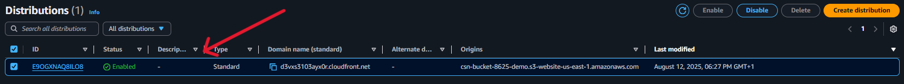
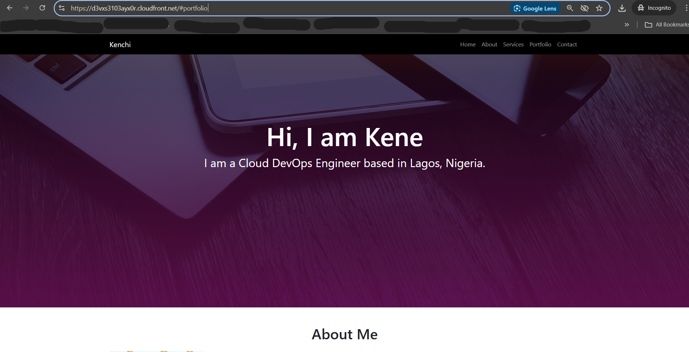

## Task
Deploy a personal static website using S3 and Cloudfront. Upload html files to an S3 bucket, enable static website hosting and configure the bucket for public access by adding the appropriate bucket permission.

## Deliverable
Provide screenshots of S3 bucket configuration showing static website hosting is enabled, along with the bucket policy used to grant this access. Include a screenshot of CloudFront distribution settings and its deployment status. Lastly, include a screenshot of your live website accessed through the cloudfront domain.

**For this project, I will provision the infrastructure with Terraform instead of using the AWS management console to improve my terraform skills, I will be needing an AWS account with programmatic access, an IAM user AWS CLI and Terraform**.

## Setup
The terraform resources for this project includes an s3 bucket with website hosting enabled and a bucket policy to grant public access, and also a cloudfront distribution with s3 as an origin to serve content globally.

## Steps
- Create the config file with terraform, these files include: 
- `main.tf` - holds the resources to create a bucket (with an attribute to automatically delete all objects when destroying the bucket), to make the bucket a static website, to manage s3 bucket-level public access block configuration, to attach a policy to an S3 bucket resource to grant public read access to the objects in the bucket, to automate file upload to S3 bucket, using the aws_s3_object resource, to create an Amazon CloudFront web distribution with S3 as the origin to serve content globally.
- `provider.tf` - holds the provider and its configurations.
- `outputs.tf` - prints out the URLs after deployment for easy access to avoid digging around the AWS Console.

- Configure the CLI with `aws configure`.

- Run a `terraform init` to initialize the working directory containing my configuration files to download all the necessary provider plugins.

- Run a `terraform plan` to create an execution plan used to preview the changes that Terraform plans to make to my infrastructure.

- Run a `terrform apply` to execute the actions proposed in the plan, the `--auto-approve` flag skips the interactive approval prompt.

- The images below show the deliverables required from this task which includes:
- S3 bucket configuration showing static website hosting is enabled.

- The bucket policy used to grant this access.

- CloudFront distribution settings and its deployment status.

- Live website accessed through the cloudfront domain.

<!--  -->

- To avoid incurring costs, I used the `terraform destroy` command to teardown my resources.

## An error I encountered
- Error 1: This error occurred because I did not follow AWS’s strict naming rule for S3 bucket (Among other rules, my bucket name had underscore, I resolved by changing the bucket from `csn_bucket_8625_demo` to `csn-bucket-8625-demo`)

- Error 2: This error occurred because my s3 bucket-level public access block setting was blocked, preventing me from attaching a public bucket policy. I resolved it by allowing public access for the bucket before applying my policy because this feature needs to be enabled to successfully attach a bucket policy.

