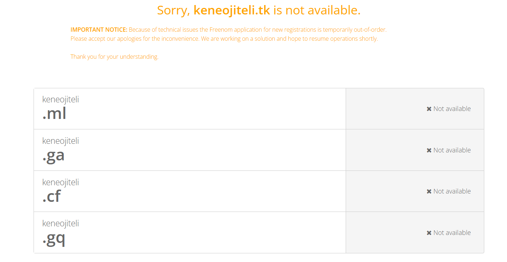
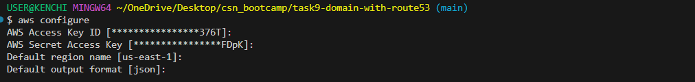

## Task
Register a free domain on freenom.com and connect it to AWS Route 53 by updating the nameservers with those from your hosted zones. Create a cloudfront distribution that serves your S3 static website, then request and validate a free SSL certificate using ACM with DNS validation in Route 53. Attach the certificate to cloudfront and confirm your site loads over HTTPS using your custom domain. If you cannot use a custom domain, follow the same steps and explain what you would have done.

## Deliverable
Provide screenshots of your Route 53 hosted zone, the validated SSL certificate in AWS Certificate Manager, Cloudfront settings with your custom domain, and your website loading over HTTPS. If you simulated the steps, briefly describe your approach.

**For this project, I will provision the infrastructure with Terraform instead of using the AWS management console to improve my terraform skills, I will be needing an AWS account with programmatic access, an IAM user AWS CLI and Terraform**.

## Setup
This project requires acces to a domain name, on my part I tried to get a free domain name from `freenom.com` but I couldn't get a free domain and the domain names were quite pricey, so I will carry out this task without a domain name.

## File Structure
- Create the config file with terraform, these files include: 
- `main.tf` - holds the resources to createCreate a cloudfront distribution that serves your S3 static website, then request and validate a free SSL certificate using ACM with DNS validation in Route 53.
- `provider.tf` - holds the provider and its configurations.
- `outputs.tf` - prints out the URLs after deployment for easy access to avoid digging around the AWS Console.
- `s3-content` - holds my website code that will be uploaded to my s3 bucket.

## Simulation Steps
- Buy/Register a free domain (from Freenom): Go to freenom.com and register a free domain (e.g.,keneojiteli.tk).

- Create a Hosted Zone in Route 53 for your domain: this step creates a Hosted Zone in Route 53 and AWS gives me 4 nameservers (NS records). 

- Point Freenom nameservers to AWS Route 53 nameservers: Then I will copy those to Freenom → Manage Domain → Management Tools → Nameservers → Use custom → Paste AWS nameservers, making Route 53 authoritative for my domain.

- Host a static website in S3: this is the source cloudfront will use to fetch objectsf from, it also includes the objects to be uploaded to my bucket

- Get an SSL certificate from ACM (DNS validated in Route 53): CloudFront requires ACM certs to be in `us-east-1`. Terraform automatically create DNS validation records in Route 53 and ACM validates my domain.

- Use CloudFront in front of the bucket: CloudFront sits in front of my S3 bucket (it uses my bucket as an origin). It attches SSL cert and the requests are HTTPS only.

- Route 53 Alias Record for Domain, pointing my domain name to cloudfront.

- Attach it to CloudFront and confirm HTTPS works: On my browser, I can access my site via `https://keneojiteli.tk` loads over HTTPS and is more secure than HTTP. Without a domain name, I can still access my site via cloudfront's distribution url (usually in this format, `https://d1p6h5ir5qmoe9.cloudfront.net`), A custom domain is preferred because it can be customised by the user and is more secure.

- All things being equal, the order of steps to provision the resources using terraform is:

- Configure the CLI with `aws configure`.

- Run a `terraform init` to initialize the working directory containing my configuration files to download all the necessary provider plugins.

- Run a `terraform plan` to create an execution plan used to preview the changes that Terraform plans to make to my infrastructure.

- Run a `terrform apply` to execute the actions proposed in the plan, the `--auto-approve` flag skips the interactive approval prompt.

- To avoid incurring costs, I used the `terraform destroy` command to teardown my resources.

